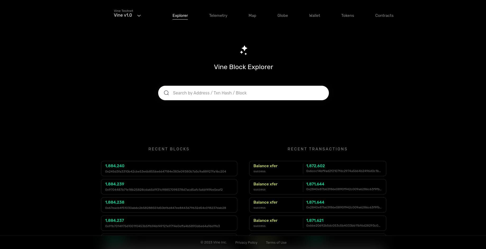

<a name="readme-top"></a>

<!-- PROJECT LOGO -->
<br />
<div align="center">
  <a href="https://github.com/PEER-Inc/explorer-blockchain-sync/tree/main#readme">
    
  </a>

  <h3 align="center">Vine-explorer-backend</h3>

  <p align="center">
    A blockchain explorer tool or service allowing users to interact with and explore the data stored on a blockchain, providing real-time access to transaction details, block information, wallet balances, and historical data for Vine blockchain network.
    <br />
    <a href="https://explorer.peer.inc/"><strong>Vine Explorer »</strong></a>
    <br />
  </p>
</div>


<!-- TABLE OF CONTENTS -->
<details>
  <summary>Table of Contents</summary>
  <ol>
    <li>
      <a href="#about-the-project">About The Project</a>
      <ul>
        <li><a href="#built-with">Built With</a></li>
      </ul>
    </li>
    <li>
      <a href="#getting-started">Getting Started</a>
      <ul>
        <li><a href="#prerequisites">Prerequisites</a></li>
        <li><a href="#installation">Installation</a></li>
      </ul>
    </li>
    <li><a href="#license">License</a></li>
    <li><a href="#acknowledgments">Acknowledgments</a></li>
  </ol>
</details>


<!-- ABOUT THE PROJECT -->
## About The Project



A blockchain explorer tailored for a specific blockchain network is a specialized web application that provides in-depth and real-time insight into the transactions, blocks, and data of that particular blockchain. It serves as a comprehensive window into the inner workings of the network, offering the following features:

1. **Search and Query**: Users can search for specific transactions, blocks, addresses, or transaction IDs, making it easy to track and verify transactions.

2. **Transaction Details**: Detailed information on each transaction, including sender and receiver addresses, transaction value, timestamps, and transaction status.

3. **Block Information**: Access to the latest and historical blocks, with details such as block height, timestamp, and the list of transactions within each block.

4. **Address Monitoring**: The ability to explore the transaction history of specific wallet addresses, allowing users to view balances and transaction flows.

5. **Network Statistics**: Charts and graphs illustrating network statistics, such as the number of transactions, block production rate, and network hash rate.

6. **User Interface**: A well-designed and responsive user interface for easy navigation and exploration.


### Built With

This section should list any major frameworks/libraries used to bootstrap your project. Leave any add-ons/plugins for the acknowledgements section. Here are a few examples.

* [![NodeJS][NodeJS]][Node-url]
* [![ExpressJs][ExpressJS]][Express-url]
* [![Cassandra][Apache-Cassandra]][Cassandra-url]
* [![Typescript][Typescript]][Typescript-url]


<!-- GETTING STARTED -->
## Getting Started

This is an example of how you may give instructions on setting up your project locally.
To get a local copy up and running follow these simple example steps.

### Prerequisites

This is an example of how to list things you need to use the software and how to install them.
* npm
  ```sh
  npm install npm@latest -g
  ```

### Installation

_Below is an example of how you can instruct your audience on installing and setting up your app.

1. Clone the repo
   ```sh
   git clone https://github.com/PEER-Inc/explorer-backend.git
   ```
2. Install NPM packages
   ```sh
   npm run set
   ```
3. Enter the env in `src/config/local.env`
   ```sh
   PORT........
   ```
4. Install husky hooks
   ```sh
   npm run prepare
   ```
5. Run the app in developement mode
   ```sh
   npm run dev
   ```   

<!-- LICENSE -->
## License

Distributed under the MIT License. See `LICENSE.txt` for more information.


<!-- ACKNOWLEDGMENTS -->
## Acknowledgments

Use this space to list resources you find helpful and would like to give credit to. I've included a few of my favorites to kick things off!

* [Express Cassandra](https://cassandra.apache.org/doc/latest/cassandra/configuration/cass_yaml_file.html)
* [Typescript](https://www.typescriptlang.org/)
* [PolkadotJS](https://polkadot.js.org/)
* [Web3](https://web3js.readthedocs.io/en/v1.10.0/)

<p align="right">(<a href="#readme-top">back to top</a>)</p>


<!-- MARKDOWN LINKS & IMAGES -->

[NodeJS]: https://img.shields.io/badge/nodejs-green?style=for-the-badge&logo=nodedotjs&logoColor=white
[Node-url]: https://nodejs.org/en/docs
[ExpressJS]: https://img.shields.io/badge/expressjs-grey?style=for-the-badge&logo=expressdotjs&logoColor=white
[Express-url]: https://expressjs.com/
[Apache-Cassandra]: https://img.shields.io/badge/Express_cassandra-lightblue?style=for-the-badge&logo=apachecassandra&logoColor=white
[Cassandra-url]: https://cassandra.apache.org/doc/latest/cassandra/getting_started/index.html
[Typescript]: https://img.shields.io/badge/typescript-blue?style=for-the-badge&logo=typescript&logoColor=white
[Typescript-url]: https://www.typescriptlang.org/
